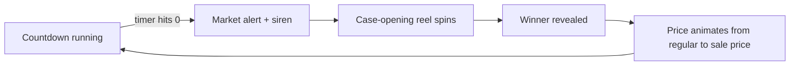

<div align="center">


# Crash boursier

**A stock-market-style price drop display for bar TVs.**
Every round, one drink "crashes" to a sale price, revealed with a case-opening reel, a market alert and a live price chart.


</div>

---

## Table of contents

- [Overview](#overview)
- [Features](#features)
- [Screenshots](#screenshots)
- [How a round works](#how-a-round-works)
- [Tech stack](#tech-stack)
- [Getting started](#getting-started)
- [Configuration](#configuration)
- [Managing the menu](#managing-the-menu)
- [Theming](#theming)
- [Running it on a bar TV](#running-it-on-a-bar-tv)
- [Project structure](#project-structure)
- [Available scripts](#available-scripts)
- [Architecture notes](#architecture-notes)

## Overview

Crash boursier turns a bar's drink specials into a show. The screen looks like a trading floor: a live market grid, a scrolling ticker and a countdown to the next "crash". When the timer hits zero, a market alert takes over the screen, a CS:GO-style reel spins through the menu, and the winning drink drops to its sale price for the next round.

A second, independent rotation handles **shooters**: at a fixed interval there is a random draw, and only some draws put a shooter on sale. That keeps customers watching the screen.

The app runs fully client-side and needs no backend or database. The menu lives in two JSON files, and state is saved in the browser, so a refresh or a power cut doesn't reset the round.

## Features

- **Timed drink crashes:** a digital countdown changes color as the crash approaches (green → orange → red).
- **Case-opening reveal:** a horizontal reel with tick sounds, deceleration and a winner chime.
- **Full-screen market alert:** layered red transitions, a falling price chart and fake index tickers.
- **Live price chart:** each crashed drink gets a smooth chart dropping from its regular price to its sale price, with an animated price counter.
- **Random shooter draws:** a configurable interval and win chance, with their own countdown, progress bar and an animated "no shooter" state.
- **Ticker tape:** the whole menu scrolls at the bottom of the screen, with the current crash highlighted.
- **Generated sounds:** a siren, reel ticks and a win chime, all built with the Web Audio API (no audio files), plus a mute toggle.
- **Survives refreshes:** the current drink, shooter and remaining time are saved in `localStorage`, including the paused state.
- **Hidden controls:** pause, skip and mute buttons slide in from the top-right corner on hover. On touch screens they're always visible.
- **Light and dark themes:** a token-based design system, switched with a single class.
- **Fully responsive:** it's built for a 1080p or 4K TV and scales down cleanly to laptops, tablets and phones.
- **Respects reduced motion:** looping decorative animations turn off when the OS asks for less motion.

## Screenshots

| Dashboard (light) | Case-opening reel |
| :---: | :---: |
|  |  |

| Market crash alert | Dashboard (dark) |
| :---: | :---: |
|  |  |

## How a round works



1. **Countdown.** The main timer counts down `TIMER_TOTAL_MINUTES`. It turns orange at 40% of the time left and red at 20%.
2. **Alert.** When the timer hits zero, a full-screen transition plays with the siren.
3. **Reel.** The menu spins past a center marker, and the reel never lands on the drink that was just on sale.
4. **Reveal.** The winning drink takes the main card, its chart draws in, and its price counts down to the sale price.
5. **Repeat.** A new round starts automatically.

Shooters run on their own loop. Every `SHOT_ROUND_MINUTES` there's a draw, and it has a `SHOT_CHANCE` probability of putting a shooter on sale for that round.

## Tech stack

| Area | Choice |
| --- | --- |
| Framework | [React 19](https://react.dev) + [TanStack Start](https://tanstack.com/start) / Router (file-based routing) |
| Build | [Vite 8](https://vite.dev) |
| Language | TypeScript |
| Styling | [Tailwind CSS v4](https://tailwindcss.com) with CSS-variable design tokens and container queries |
| Animation | [Motion](https://motion.dev) (variants, `AnimatePresence`, `useAnimate` sequences) |
| Timers | [react-timer-hook](https://github.com/amrlabib/react-timer-hook) |
| Icons | [Tabler Icons](https://tabler.io/icons) |
| Fonts | Roboto (bundled via Fontsource), DS-Digital for the countdowns |
| Audio | Web Audio API (sounds generated in code) |
| Quality | ESLint (TanStack config), Prettier |

## Getting started

### Prerequisites

- **Node.js 20+** (LTS recommended)
- npm (or pnpm)

### Install and run

```bash
git clone <your-repo-url> crash-boursier
cd crash-boursier
npm install
npm run dev
```

Then open **http://localhost:3000**.

> **Note: sound.** Browsers block audio until someone interacts with the page. Click anywhere once after loading, and the alert, reel and chime sounds will play from then on.

### Production build

```bash
npm run build     # outputs to dist/
npm run preview   # serves the production build locally
```

## Configuration

All timing and sound settings are in [`src/lib/config.ts`](src/lib/config.ts).

| Constant | Default | Description |
| --- | --- | --- |
| `TIMER_TOTAL_MINUTES` | `20` | Length of one drink round |
| `SHOT_ROUND_MINUTES` | `15` | Time between two shooter draws |
| `SHOT_CHANCE` | `1 / 5` | Probability that a draw puts a shooter on sale |
| `SOUNDS_ENABLED` | `true` | Master switch. Set it to `false` for no sound at all |
| `SOUND_VOLUME` | `0.8` | Global volume, from `0` to `1` |
| `SOUNDS` | all `true` | Turns individual sounds on or off: `alert` (siren), `spin` (reel ticks), `select` (win chime) |

## Managing the menu

Drinks and shooters are plain JSON, so no code changes are needed.

- Drinks: [`src/data/drinks.json`](src/data/drinks.json)
- Shooters: [`src/data/shots.json`](src/data/shots.json)

```json
{
  "name": "Mexican Mule",
  "salePrice": 10,
  "regularPrice": 13,
  "imgSrc": "src/assets/images/mexican_mule.svg"
}
```

| Field | Type | Description |
| --- | --- | --- |
| `name` | `string` | Displayed name. It must be unique, because it's used to restore state after a refresh |
| `salePrice` | `number` | Price during the crash |
| `regularPrice` | `number` | Normal price, shown struck through. The discount % is calculated automatically |
| `imgSrc` | `string` | Path to an image in `src/assets/images/` |

**To add a drink:** drop its image (SVG, PNG or WebP, ideally with a transparent background) into `src/assets/images/`, then add an entry to the JSON file. Images are bundled through `import.meta.glob`, so they work in both development and production builds.

## Theming

Every color is a CSS variable defined in [`src/styles.css`](src/styles.css). The light theme is under `:root` and the dark theme under `.dark`. Tailwind utilities such as `bg-surface`, `text-ink` and `text-accent` map to those tokens, so switching themes is a single class on `<body>`:

```ts
document.body.classList.toggle('dark')
```

Dark is the default (set in [`src/routes/__root.tsx`](src/routes/__root.tsx)). The brand accent (`--accent`) is the logo yellow and is used for all crash prices.

The layout is sized in `rem`, and the root font size scales with the viewport, so the whole interface keeps the same proportions on a 55" TV and on a laptop.

## Running it on a bar TV

1. Build and serve the app (`npm run build`, then any static host or `npm run preview`), or run the dev server on the machine connected to the TV.
2. Open it in Chrome or Edge in **kiosk / full-screen mode**. For example:
   ```bash
   chrome --kiosk http://localhost:3000
   ```
3. **Click once** on the page to enable sound.
4. Move the mouse to the **top-right corner** to reveal the controls:
   - **Pause / play:** freezes both the drink and shooter timers.
   - **Next:** skips to the next drink (runs the reel) or forces a new shooter draw.
   - **Mute:** silences every sound instantly. The setting is remembered.

Because state is saved in the browser, a TV reboot or a page refresh picks up exactly where it left off.

## Project structure

```text
src/
├── assets/
│   ├── fonts/              # DS-Digital font for the countdowns
│   └── images/             # Logo, drink and shooter images
├── components/
│   ├── app/                # Error and 404 screens
│   ├── drink-reveal/       # Main "drink in crash" card: chart, image, animated price
│   ├── header/             # Page header with logo
│   ├── layer-transition/   # Full-screen market alert between rounds
│   ├── live-background/    # Market grid, price blips and the bottom ticker
│   ├── menu/               # Hover menu: pause, skip, mute
│   ├── shot/               # Shooter card: active and empty states, countdown
│   ├── spin-drinks/        # Case-opening reel
│   ├── timer/              # Main countdown and its state (on time / soon / urgent)
│   └── ui/                 # Design-system primitives: Badge, IconButton, OldPrice…
├── data/                   # drinks.json and shots.json (the menu)
├── hooks/
│   ├── useDrinkRotation.ts # Drink round lifecycle: timer, spin, pause, persistence
│   └── useShotRotation.ts  # Shooter draws: interval, chance, persistence
├── lib/
│   ├── config.ts           # ⚙️ All tunable settings
│   ├── sounds.ts           # Web Audio sounds and mute
│   ├── images.ts           # Resolves JSON image paths to bundled URLs
│   ├── pricing.ts          # Discount calculations
│   └── …                   # Storage, random helpers, easing, formatting
├── routes/
│   ├── __root.tsx          # HTML shell, theme class, global styles
│   └── index.tsx           # The dashboard page
├── schema/                 # Drink type
└── styles.css              # Design tokens, themes and type scale
```

## Available scripts

| Command | Description |
| --- | --- |
| `npm run dev` | Start the dev server on port 3000 |
| `npm run build` | Build for production |
| `npm run preview` | Preview the production build |
| `npm run lint` | Run ESLint |
| `npm run format` | Format with Prettier and auto-fix lint issues |
| `npm run check` | Check formatting without writing |
| `npm run generate-routes` | Regenerate the TanStack Router route tree |

## Architecture notes

- **Client-only route.** The dashboard route sets `ssr: false`, because it depends on `localStorage`, timers and the Web Audio API. There's nothing to render on the server.
- **Timers use deadlines, not ticks.** Each rotation stores an `expiresAt` timestamp (or the remaining milliseconds while paused), so time stays accurate even if the tab is throttled or reloaded.
- **Safe state changes.** A pending spin blocks pausing and double-skipping, so the timer, the reel and the saved state can't drift apart.
- **Sounds without files.** Every sound is scheduled on an `AudioContext` and routed through a single gain "bus", which makes muting instant, even for a siren that's already playing.
- **Container queries.** Cards size their contents with `cqw`/`cqh` units, so the same component looks right whether it takes half the TV or the full width of a phone.

---

<div align="center">
Made in Trois-Rivières, QC 🍹
</div>
