<div align="center">

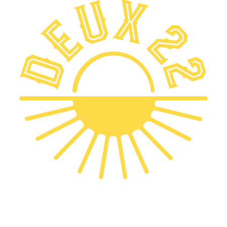

# Crash boursier

**A stock-market-style price drop display for bar TVs.**
Every round, one drink "crashes" to a sale price, revealed with a case-opening reel, a market alert and a live price chart. Once a night, **La Grande Dépression** puts the whole menu on sale at once.


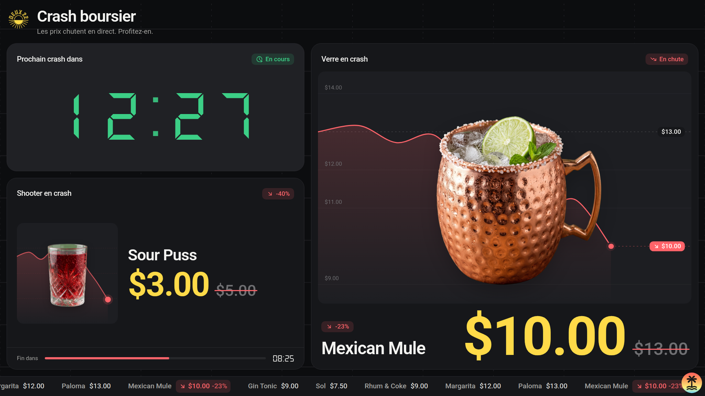

</div>

---

## Table of contents

- [Overview](#overview)
- [Features](#features)
- [Screenshots](#screenshots)
- [How a round works](#how-a-round-works)
- [La Grande Dépression](#la-grande-dépression)
- [Tech stack](#tech-stack)
- [Getting started](#getting-started)
- [Configuration](#configuration)
- [Managing the menu](#managing-the-menu)
- [Theming](#theming)
- [Running it on a bar TV](#running-it-on-a-bar-tv)
- [Deploying](#deploying)
- [Project structure](#project-structure)
- [Available scripts](#available-scripts)
- [Architecture notes](#architecture-notes)

## Overview

Crash boursier turns a bar's drink specials into a show. The screen looks like a trading floor: a live market grid, a scrolling ticker and a countdown to the next "crash". When the timer hits zero, a market alert takes over the screen, a CS:GO-style reel spins through the menu, and the winning drink drops to its sale price for the next round.

A second, independent rotation handles **shooters**: at a fixed interval there's a random draw, and only some draws put a shooter on sale. That keeps customers watching the screen.

Once a night, the staff can trigger **La Grande Dépression**: a full-screen market collapse after which _every_ drink and shooter is on sale for one round. When it ends, the market "recovers" and the normal rounds pick up again.

The app runs fully client-side and needs no backend or database. The menu lives in two JSON files, and state is saved in the browser, so a refresh or a power cut doesn't reset anything, not even a Grande Dépression in progress.

## Features

**Rounds**

- **Timed drink crashes:** a digital countdown changes color as the crash approaches (green → orange → red).
- **Case-opening reveal:** a horizontal reel with tick sounds, deceleration and a winner chime.
- **Full-screen market alert:** layered red transitions, a falling price chart and fake index tickers.
- **Live price chart:** each crashed drink gets a smooth chart dropping from its regular price to its sale price, with an animated price counter.
- **Random shooter draws:** a configurable interval and win chance, with their own countdown and progress bar. A picked shooter gets a mini crash chart behind it; with no shooter, a row of glasses keeps "drawing" like a roulette.

**La Grande Dépression** (see [below](#la-grande-dépression))

- **One-time event:** launched from the staff menu with a confirmation, lasting one round.
- **Epic intro:** slamming title with screen shake, the market % falling to −89.2%, every drink dropping in, plus its own sound.
- **Event page:** the whole screen turns deep red, and every drink and shooter shows its sale price with a big countdown.
- **Recovery outro:** "Le marché se relève", a green line climbing back up, then a smooth return to normal rounds.

**Everywhere**

- **Ticker tape:** the menu scrolls at the bottom of the screen, with crashed items highlighted.
- **Generated sounds:** a siren, reel ticks, a win chime and the Grande Dépression crash and recovery sounds, all built with the Web Audio API (no audio files), plus a mute button.
- **Survives refreshes:** the current drink, shooter, event and remaining time are saved in `localStorage`, including the paused state.
- **Hidden controls:** pause, skip, mute and Grande Dépression buttons slide in from the top-right corner on hover. On touch screens they're always visible.
- **Light and dark themes:** a token-based design system, switched with a single class.
- **Fully responsive:** it's built for a 1080p or 4K TV and scales down cleanly to laptops, tablets and phones.
- **Smooth on modest hardware:** the large drink images are redrawn once at a lighter size in the browser, so animations don't stutter.
- **Respects reduced motion:** decorative loops turn off and scenes use calm fades when the OS asks for less motion.

## Screenshots

| Dashboard (light) | Case-opening reel |
| :---: | :---: |
| 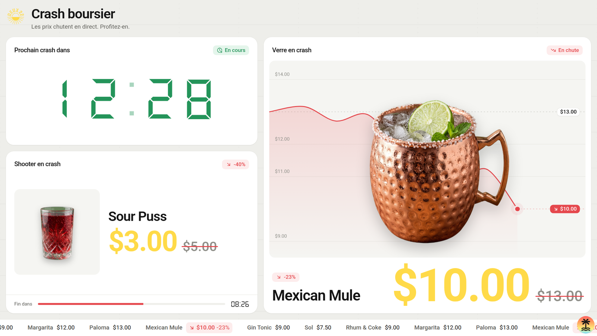 | 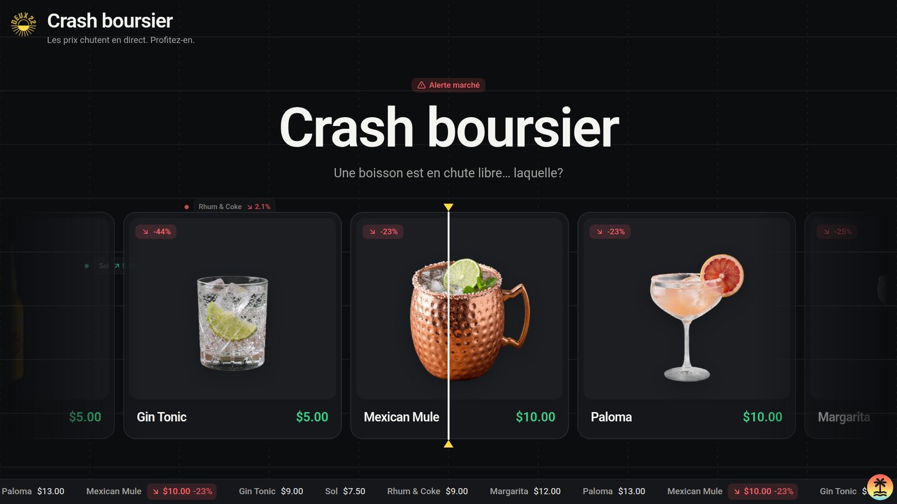 |

| Market crash alert | Dashboard (dark) |
| :---: | :---: |
| 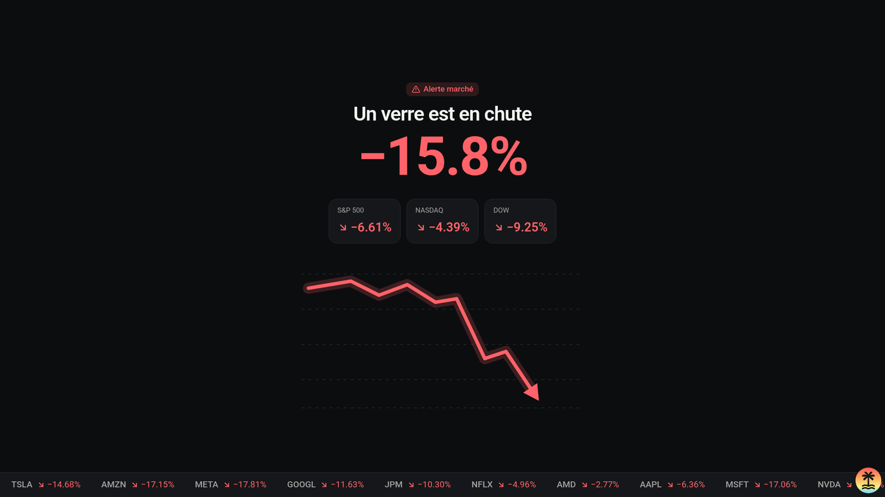 |  |

**La Grande Dépression**

| Intro | Event page |
| :---: | :---: |
| 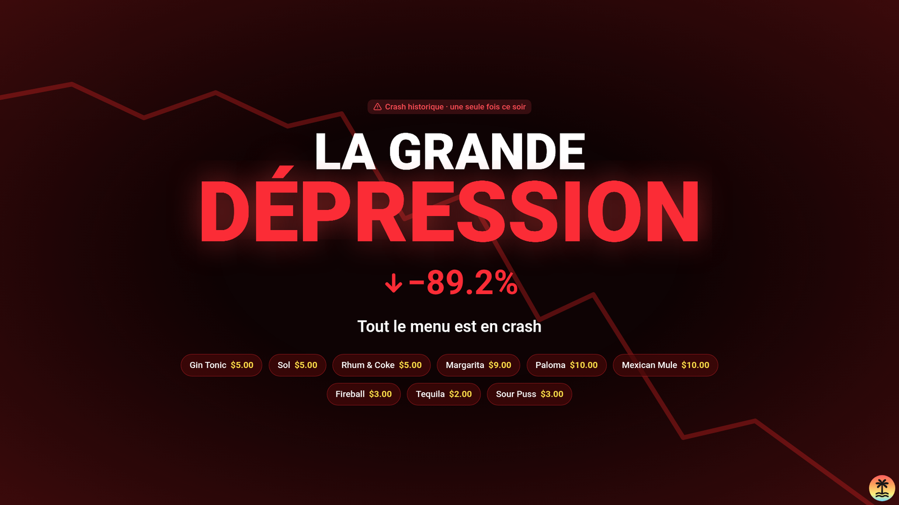 | 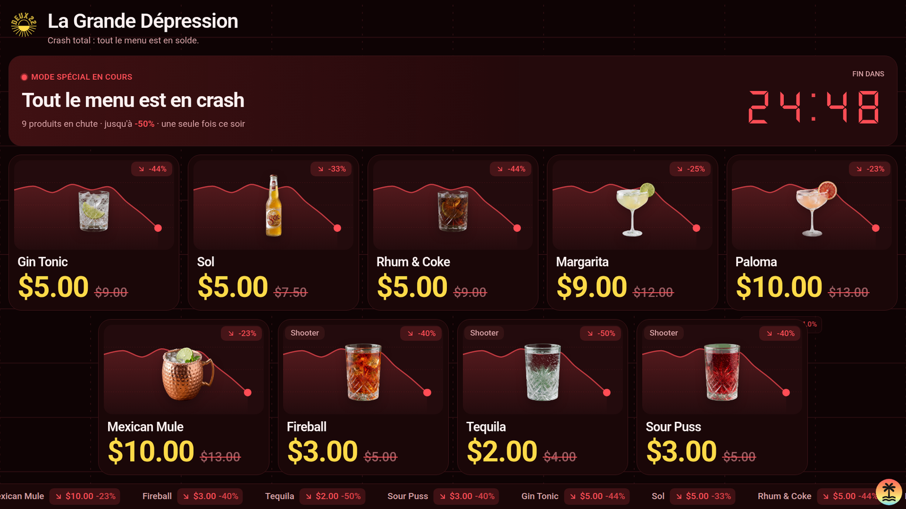 |

| Recovery outro | Staff menu |
| :---: | :---: |
| 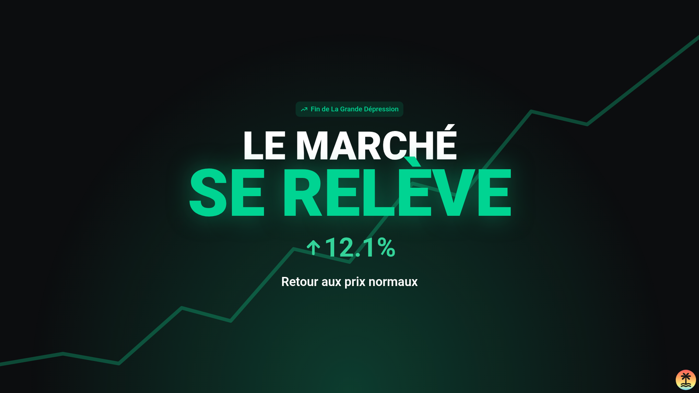 | 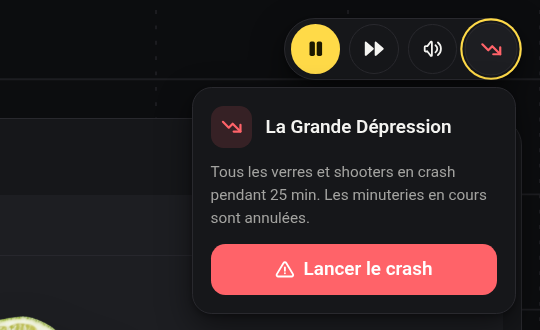 |

## How a round works

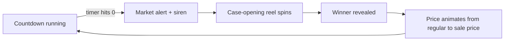

1. **Countdown.** The main timer counts down `TIMER_TOTAL_MINUTES`. It turns orange at 40% of the time left and red at 20%.
2. **Alert.** When the timer hits zero, a full-screen transition plays with the siren.
3. **Reel.** The menu spins past a center marker, and the reel never lands on the drink that was just on sale.
4. **Reveal.** The winning drink takes the main card, its chart draws in, and its price counts down to the sale price.
5. **Repeat.** A new round starts automatically.

Shooters run on their own loop. Every `SHOT_ROUND_MINUTES` there's a draw, and it has a `SHOT_CHANCE` probability of putting a shooter on sale for that round.

## La Grande Dépression

A special event meant to happen **once a night**: for one round, every drink and every shooter is on sale.

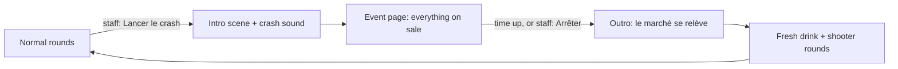

**Launching it.** Hover the top-right corner and press the red falling-chart button (the 4th button). A confirmation appears, so it can't be launched by accident. Press **Lancer le crash**.

**What happens:**

1. **Intro.** Dark red panels slide up and the normal drink and shooter timers are frozen. "LA GRANDE" then "DÉPRESSION" slam in with a screen shake, the market % falls to **−89.2%** (the real US stock market fall, 1929–1932), and every drink and shooter drops in with its sale price. The panels then slide away.
2. **Event page.** The whole page turns deep red and the title becomes "La Grande Dépression". A banner shows a big countdown, and every drink and shooter is shown at its sale price with the regular price crossed out. The ticker shows everything crashed. The menu button is solid red while the event is on.
3. **Outro.** When time is up, or when staff press the red button again and choose **Arrêter**, red then green panels slide up. "LE MARCHÉ" then "SE RELÈVE" rise in, the % climbs from −89.2% back to +12.4%, and "Retour aux prix normaux" shows up.
4. **Back to normal.** A brand new drink round and a fresh shooter draw start, with full timers.

**Good to know:**

- The event lasts `DEPRESSION_MINUTES` (25 by default), set separately from the drink rounds in `src/lib/config.ts`.
- **Pause** works during the event, on its countdown. Skipping is hidden while everything is on sale. The pause button is disabled while a scene is playing.
- **Refresh-safe.** A refresh during the event resumes it with the right time left. If the event ended while the page was closed, or a refresh happens during the outro, the page goes straight back to normal rounds.
- **Nothing else crashes during the event.** A drink or shooter timer that runs out during the launch is dropped instead of playing its alert over the event page.

## Tech stack

| Area | Choice |
| --- | --- |
| Framework | [React 19](https://react.dev) + [TanStack Start](https://tanstack.com/start) / Router (file-based routing) |
| Build | [Vite 8](https://vite.dev), with [Nitro](https://nitro.build) for deployment |
| Language | TypeScript |
| Styling | [Tailwind CSS v4](https://tailwindcss.com) with CSS-variable design tokens and container queries |
| Animation | [Motion](https://motion.dev) (variants, `AnimatePresence`, `useAnimate` sequences) and Tailwind's `animate-ping` / `animate-pulse` |
| Timers | [react-timer-hook](https://github.com/amrlabib/react-timer-hook) |
| Icons | [Tabler Icons](https://tabler.io/icons) |
| Fonts | Roboto (bundled via Fontsource), DS-Digital for the countdowns |
| Audio | Web Audio API (sounds generated in code) |
| Quality | ESLint (TanStack config), Prettier |

## Getting started

### Prerequisites

- **Node.js 20+** (LTS recommended)
- npm (or pnpm)

### Install and run

```bash
git clone <your-repo-url> crash-boursier
cd crash-boursier
npm install
npm run dev
```

Then open **http://localhost:3000**.

> **Note: sound.** Browsers block audio until someone interacts with the page. Click anywhere once after loading, and every sound will play from then on.

### Production build

```bash
npm run build     # builds the app (for Vercel, see Deploying)
npm run preview   # serves the production build locally
```

## Configuration

All timing and sound settings are in [`src/lib/config.ts`](src/lib/config.ts).

| Constant | Default | Description |
| --- | --- | --- |
| `TIMER_TOTAL_MINUTES` | `25` | Length of one drink round |
| `SHOT_ROUND_MINUTES` | `15` | Time between two shooter draws |
| `SHOT_CHANCE` | `1 / 3` | Probability that a draw puts a shooter on sale |
| `DEPRESSION_MINUTES` | `25` | Length of La Grande Dépression, set on its own (independent from the drink rounds) |
| `SOUNDS_ENABLED` | `true` | Master switch. Set it to `false` for no sound at all |
| `SOUND_VOLUME` | `0.8` | Global volume, from `0` to `1` |
| `SOUNDS` | all `true` | Turns individual sounds on or off: `alert` (siren), `spin` (reel ticks), `select` (win chime), `depression` (Grande Dépression crash and recovery sounds) |

The Grande Dépression scenes (panel colors, timing of each step, the −89.2% figure) are in [`src/components/depression/constants.ts`](src/components/depression/constants.ts).

## Managing the menu

Drinks and shooters are plain JSON, so no code changes are needed.

- Drinks: [`src/data/drinks.json`](src/data/drinks.json)
- Shooters: [`src/data/shots.json`](src/data/shots.json)

```json
{
  "name": "Mexican Mule",
  "salePrice": 10,
  "regularPrice": 13,
  "imgSrc": "src/assets/images/mexican_mule.svg"
}
```

| Field | Type | Description |
| --- | --- | --- |
| `name` | `string` | Displayed name. It must be unique, because it's used to restore state after a refresh |
| `salePrice` | `number` | Price during the crash (and during La Grande Dépression) |
| `regularPrice` | `number` | Normal price, shown struck through. The discount % is calculated automatically |
| `imgSrc` | `string` | Path to an image in `src/assets/images/` |

**To add a drink:** drop its image (SVG, PNG or WebP, ideally with a transparent background) into `src/assets/images/`, then add an entry to the JSON file. Images are bundled through `import.meta.glob`, so they work in both development and production builds. The Grande Dépression page picks up new items automatically and arranges them in rows.

> **Tip:** keep images around 1000 px. Very large files (the current ones are 2048 px pictures inside SVGs) work, because the app makes lighter copies when the page loads, but smaller files load faster.

## Theming

Every color is a CSS variable defined in [`src/styles.css`](src/styles.css). The light theme is under `:root`, the dark theme under `.dark`, and the Grande Dépression red theme under `.depression`. Tailwind utilities such as `bg-surface`, `text-ink` and `text-accent` map to those tokens, so switching themes is a single class on `<body>`:

```ts
document.body.classList.toggle('dark')
```

Dark is the default (set in [`src/routes/__root.tsx`](src/routes/__root.tsx)). The `depression` class is added and removed automatically during the event. The brand accent (`--accent`) is the logo yellow and is used for all sale prices.

The layout is sized in `rem`, and the root font size scales with the viewport, so the whole interface keeps the same proportions on a 55" TV and on a laptop.

## Running it on a bar TV

1. Open the deployed site (see [Deploying](#deploying)), or run the dev server on the machine connected to the TV.
2. Open it in Chrome or Edge in **kiosk / full-screen mode**. For example:
   ```bash
   chrome --kiosk https://your-site.vercel.app
   ```
3. **Click once** on the page to enable sound.
4. Move the mouse to the **top-right corner** to reveal the controls:

| Button | What it does |
| --- | --- |
| ⏯ **Pause / play** | Freezes the drink and shooter timers, or the Grande Dépression countdown during the event |
| ⏭ **Next** | Skips to the next drink (runs the reel) or forces a new shooter draw. Hidden during La Grande Dépression |
| 🔊 **Mute** | Silences every sound instantly. The setting is remembered |
| 📉 **La Grande Dépression** | Launches the event (with a confirmation), or stops it early. Solid red while it's on |

Because state is saved in the browser, a TV reboot or a page refresh picks up exactly where it left off.

## Deploying

The project deploys to **Vercel** as-is. TanStack Start needs a small server to send the page, and the [Nitro](https://nitro.build) plugin in [`vite.config.ts`](vite.config.ts) builds it in the format Vercel expects. [`vercel.json`](vercel.json) tells Vercel it's a TanStack Start app.

1. Push the repo to GitHub and import it in Vercel.
2. In **Settings → Build and Deployment**, keep the **Framework Preset** on _TanStack Start_ and leave the **Output Directory** override off.
3. Every push to the main branch redeploys automatically.

## Project structure

```text
src/
├── assets/
│   ├── fonts/              # DS-Digital font for the countdowns
│   └── images/             # Logo, drink and shooter images
├── components/
│   ├── app/                # Error and 404 screens
│   ├── depression/         # La Grande Dépression: intro/outro scenes, event page, cards, timing
│   ├── drink-reveal/       # Main "drink in crash" card: chart, image, animated price
│   ├── header/             # Page header with logo (title changes during the event)
│   ├── layer-transition/   # Full-screen market alert between rounds
│   ├── live-background/    # Market grid, price blips and the bottom ticker
│   ├── menu/               # Hover menu: pause, skip, mute, Grande Dépression (+ popovers)
│   ├── shot/               # Shooter card: active (mini crash chart) and empty (glass draw) states
│   ├── spin-drinks/        # Case-opening reel
│   ├── timer/              # Main countdown and its state (on time / soon / urgent)
│   └── ui/                 # Design-system primitives: Badge, IconButton, OldPrice…
├── data/                   # drinks.json and shots.json (the menu)
├── hooks/
│   ├── useDrinkRotation.ts # Drink round lifecycle: timer, spin, pause, persistence
│   ├── useShotRotation.ts  # Shooter draws: interval, chance, persistence
│   ├── useDepression.ts    # La Grande Dépression: countdown, pause, persistence
│   └── useImageUrl.ts      # Stable image URL for a card (light copy when ready)
├── lib/
│   ├── config.ts           # ⚙️ All tunable settings
│   ├── sounds.ts           # Web Audio sounds and mute
│   ├── images.ts           # Resolves JSON image paths; makes lighter in-memory copies
│   ├── depressionStorage.ts  # Saves/loads La Grande Dépression
│   ├── pricing.ts          # Discount calculations
│   └── …                   # Round storage, random helpers, easing, formatting
├── routes/
│   ├── __root.tsx          # HTML shell, theme class, global styles
│   └── index.tsx           # The screen: layout and the order of every scene
├── schema/                 # Drink type
└── styles.css              # Design tokens, themes (light, dark, depression) and type scale
```

## Available scripts

| Command | Description |
| --- | --- |
| `npm run dev` | Start the dev server on port 3000 |
| `npm run build` | Build for production |
| `npm run preview` | Preview the production build |
| `npm run lint` | Run ESLint |
| `npm run format` | Format with Prettier and auto-fix lint issues |
| `npm run check` | Check formatting without writing |
| `npm run generate-routes` | Regenerate the TanStack Router route tree |

## Architecture notes

- **Client-only route.** The dashboard route sets `ssr: false`, because it depends on `localStorage`, timers and the Web Audio API. There's nothing to render on the server.
- **Timers use deadlines, not ticks.** Each rotation (drinks, shooters, the event) stores an end timestamp, or the remaining milliseconds while paused, so time stays accurate even if the tab is throttled or reloaded.
- **One scene at a time.** [`routes/index.tsx`](src/routes/index.tsx) orchestrates everything: the crash alert and reel, and the Grande Dépression intro and outro. A crash never starts while a scene plays or during the event. Time running out mid-scene is queued until the scene ends.
- **Scenes are timelines.** Each full-screen scene is one Motion `useAnimate` sequence driven by a `phase` (`cover` → `reveal` → `idle`), with all its timings in one constants file. The sounds use the same timings, so impacts land on the title words.
- **Heavy work stays hidden.** Before a scene reveals the page underneath, that page is mounted a moment early, behind the opaque panels, so its first paint doesn't stutter the slide.
- **Sounds without files.** Every sound is scheduled on an `AudioContext` and routed through a single gain "bus", which makes muting instant, even for a sound that's already playing.
- **Container queries.** Cards size their contents with `cqw`/`cqh` units, so the same component looks right whether it takes half the TV or the full width of a phone.

---

<div align="center">
Made in Trois-Rivières, QC 🍹
</div>
